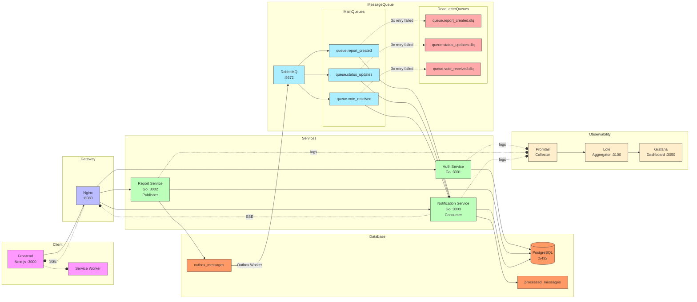

# CityConnect System Architecture

## Overview

CityConnect is a microservices-based citizen reporting platform that enables citizens to submit reports about urban issues such as infrastructure damage, health hazards, and cleanliness problems. The system is designed with separation of concerns in mind, where each service handles a specific domain of functionality. Real-time notifications are delivered through Server-Sent Events (SSE) and browser push notifications via Service Workers, while RabbitMQ handles asynchronous event distribution with guaranteed delivery through the Transactional Outbox pattern.

## System Diagram

## Component Explanations

### Frontend (Next.js)

The frontend is built with Next.js 14, a React-based framework that provides server-side rendering capabilities. It serves as the primary interface for both citizens and government administrators. Citizens can register, submit reports with various privacy levels (public, private, or anonymous), search and filter existing reports, and vote on public reports. Administrators access a dedicated dashboard filtered by their department where they can update report statuses.

The frontend communicates with backend services exclusively through the API Gateway. It never connects directly to internal services, which maintains proper separation and security boundaries. For real-time updates, the frontend establishes a persistent SSE connection to the Notification Service to receive updates when report statuses change. Additionally, a Service Worker is registered to display browser push notifications when the user is not actively viewing the application tab, ensuring they never miss important status updates.

### API Gateway (Nginx)

The Nginx gateway serves as the single entry point for all client requests. This architectural pattern provides several critical benefits. First, it handles routing by directing requests to the appropriate backend service based on URL patterns. Requests to `/api/v1/auth/*` are forwarded to the Auth Service, `/api/v1/reports/*` to the Report Service, and `/api/v1/notifications/*` to the Notification Service.

More importantly, the gateway performs centralized authentication using the `auth_request` directive. Before forwarding any protected request to a backend service, Nginx sends a subrequest to the Auth Service's `/validate` endpoint. The Auth Service validates the JWT token and returns the decoded user information, which Nginx then injects as headers (`X-User-ID`, `X-User-Role`, `X-User-Department`). This design frees backend services from implementing repetitive token validation logic, allowing them to trust the headers and focus entirely on business logic.

For SSE endpoints, the gateway bypasses nginx authentication because the browser's EventSource API cannot set custom headers. Instead, the token is passed via query parameter and validated directly by the Notification Service.

### Auth Service (Go)

The Auth Service is a dedicated microservice written in Go using the Gin framework. It handles all authentication and authorization concerns, including user registration, login, and JWT token management. When a user registers, the service hashes their password using bcrypt before storing it in the database. During login, the service verifies credentials and issues a JWT token containing the user's ID, name, role, and department information.

By isolating authentication into its own service, the system gains a security advantage. If a vulnerability is discovered in another service, the authentication data and logic remain protected in a separate boundary. The Auth Service also provides a `/validate` endpoint used by the gateway to validate tokens on every protected request.

### Report Service (Go) - Publisher

The Report Service is the core of the application's business logic. It manages the complete lifecycle of citizen reports, including creation, retrieval, updates, and status changes. The service implements a voting system where citizens can upvote or downvote public reports, with vote scores calculated atomically using database transactions to prevent race conditions.

Unlike the previous architecture where messages were published directly to RabbitMQ, the Report Service now implements the **Transactional Outbox Pattern**. When events occur (such as a new report being created, a vote being cast, or an admin updating a status), the service writes the message to the `outbox_messages` table within the same database transaction as the business operation. This guarantees that either both the business data and the message are persisted, or neither is.

An **Outbox Worker** runs as a background goroutine that polls the `outbox_messages` table and publishes pending messages to RabbitMQ. The worker uses **Publisher Confirms** to ensure RabbitMQ has acknowledged receipt before marking the message as sent. This eliminates the dual-write problem where a database commit could succeed but the RabbitMQ publish could fail.

### Notification Service (Go) - Consumer

The Notification Service is a dedicated microservice that handles all notification-related functionality. It was extracted from the Report Service to achieve proper separation between publishing and consuming responsibilities. This decoupling provides several advantages: independent scaling, isolated failure domains, and clearer code boundaries.

The service consumes messages from RabbitMQ queues and processes them to create user notifications. It maintains an **SSE Hub** that tracks connected clients by user ID. When a notification is created, the service broadcasts it through the SSE connection to the relevant user, providing instant real-time updates without polling.

For SSE authentication, the service validates JWT tokens directly from the query parameter since the browser's EventSource API cannot set custom HTTP headers. This allows the gateway to bypass its normal auth flow for the SSE endpoint while maintaining security.

### Message Queue (RabbitMQ)

RabbitMQ serves as the asynchronous message distribution layer in the system. It uses a topic exchange pattern where messages are published with routing keys and delivered to queues based on binding patterns. The system defines six queues total: three main queues and three Dead Letter Queues (DLQ).

**Main Queues:**

- `queue.report_created` - for new report submissions
- `queue.status_updates` - for admin status changes  
- `queue.vote_received` - for user votes

**Dead Letter Queues:**

- `queue.report_created.dlq`
- `queue.status_updates.dlq`
- `queue.vote_received.dlq`

The DLQ mechanism provides fault tolerance. When a message fails processing after 3 retry attempts with exponential backoff (1s → 2s → 4s), it is moved to the corresponding DLQ rather than being lost. This allows operators to inspect failed messages, fix issues, and replay them.

The RabbitMQ management interface is accessible at port 15672, providing visibility into queue depths, message rates, DLQ backlogs, and consumer status.

### Database (PostgreSQL)

PostgreSQL 15 serves as the primary persistent storage for all application data. The database stores user accounts, reports, categories, votes, notifications, and reliability tables.

**Additional Tables for Reliability:**

The `outbox_messages` table stores messages pending publication to RabbitMQ. Each row contains the message payload, routing key, and status (pending/sent). The Outbox Worker polls this table and publishes messages with Publisher Confirms before marking them as sent.

The `processed_messages` table provides **idempotency checking**. Before processing any consumed message, the Notification Service checks if the message ID already exists in this table. If it does, the message is skipped to prevent duplicate processing. This is essential for at-least-once delivery semantics where RabbitMQ may redeliver messages.

The schema is initialized automatically when the container starts using SQL scripts mounted from the `database/` directory. Relationships between entities are enforced through foreign keys, and indexes are created on frequently queried columns to optimize read performance.

### Observability Stack (Grafana, Loki, Promtail)

The observability stack provides centralized logging and monitoring capabilities for the distributed system. It consists of three components working together in a pipeline.

Promtail is the log collector that runs as a sidecar and scrapes logs from Docker container stdout/stderr streams. It attaches labels to each log entry (such as container name and service) and forwards them to the central aggregator. Promtail operates at the edge, close to log sources, ensuring minimal latency in log collection.

Loki is the log aggregator that receives logs from Promtail instances, indexes them by labels, and stores them efficiently. Unlike traditional log systems that index full log text, Loki only indexes metadata labels, making it more cost-effective for high-volume logging. Loki provides a query API that allows filtering logs by label selectors similar to Prometheus.

Grafana is the visualization dashboard that connects to Loki as a data source. Operators can query logs using LogQL, create dashboards to visualize log patterns, and set up alerts for specific error conditions. The dashboard is accessible at port 3050 with default credentials, providing a central location for infrastructure and security teams to analyze system behavior and detect anomalies.

## Reliability Patterns

### Transactional Outbox Pattern

The system implements the Transactional Outbox pattern to solve the dual-write problem. When a business operation needs to publish an event, instead of calling RabbitMQ directly, the service inserts a message row into the `outbox_messages` table within the same database transaction as the business operation.

A background Outbox Worker continuously polls for pending messages and publishes them to RabbitMQ with Publisher Confirms enabled. Only after receiving confirmation from RabbitMQ does the worker mark the message as sent. This guarantees that messages are never lost, even if the application crashes between the database commit and the RabbitMQ publish.

### Dead Letter Queue (DLQ)

Each main queue has a corresponding DLQ configured via RabbitMQ's dead letter exchange. When a consumer fails to process a message after exhausting retry attempts, the message is automatically routed to the DLQ. This prevents poison messages from blocking the queue while preserving them for later analysis and manual reprocessing.

### Retry with Exponential Backoff

The Notification Service consumer implements a retry mechanism with exponential backoff. When processing fails, the consumer waits before retrying: 1 second for the first retry, 2 seconds for the second, and 4 seconds for the third. If all retries fail, the message is rejected and moves to the DLQ.

### Idempotency Check

To handle duplicate message delivery (which can occur with at-least-once semantics), the consumer checks the `processed_messages` table before processing. If a message ID is found, processing is skipped. Otherwise, the message is processed and its ID is recorded. This ensures operations like notification creation are not duplicated.

## Authentication and Security

The system implements JWT-based authentication with role-based access control (RBAC). Four roles are defined: `warga` for regular citizens, and three admin roles (`admin_kebersihan`, `admin_kesehatan`, `admin_infrastruktur`) for department-specific government employees. Each admin can only view and manage reports within their assigned department.

For privacy-conscious citizens, the system supports anonymous reporting. When a user submits an anonymous report, their user ID is hashed using SHA-256 with a server-side salt before storage. This hash cannot be reversed to identify the original reporter, ensuring true anonymity while still allowing the system to detect if the same user submits multiple anonymous reports.

All cross-origin requests are controlled through CORS configuration, limiting which domains can access the API. The frontend origin is explicitly allowlisted while all other origins are rejected.
